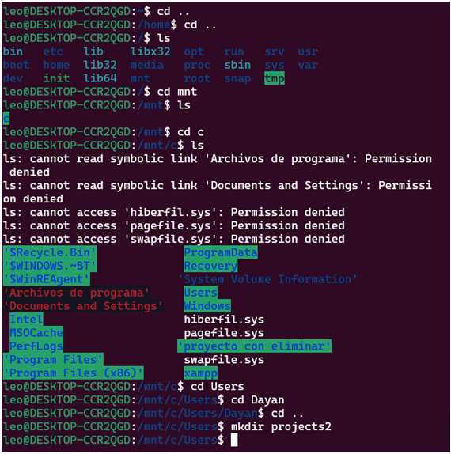
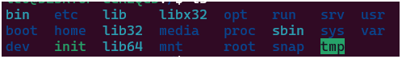
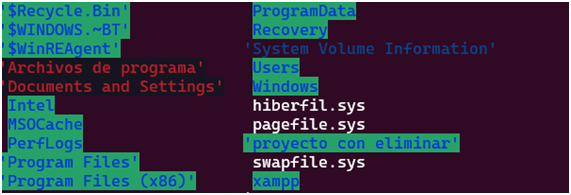
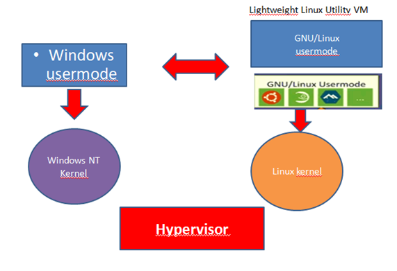
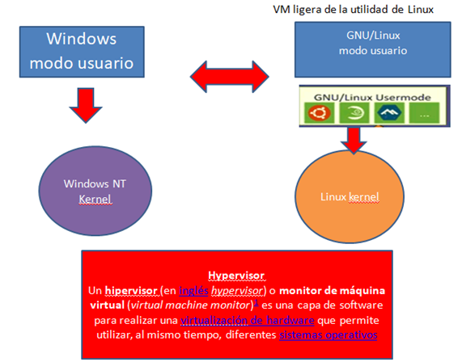
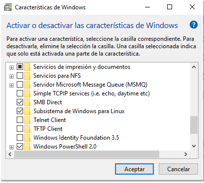
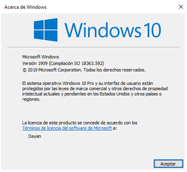
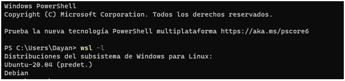
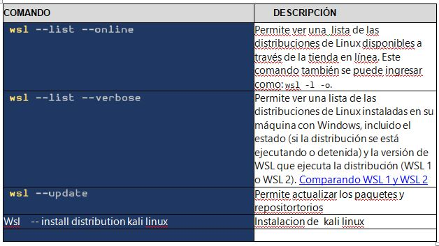
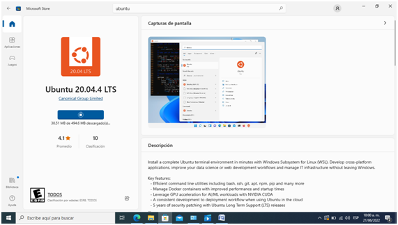

# WSL2
## Laboratorio 1

1. crear repositorio

2. 
La arquitectura de WSL2
Esta permite que el subsistema  de windows para Linux se ejecute archivos binarios  de linux en Windows, para aumentar el rendimiento del sistema de archivos y hacer compatible con la funciones del sistema.
Esta permite un cambio en manejo de los archivos binarios de Linux para interactuar también con el hardware del equipo, pero tiene las mismas funcionalidades de WSL1.
WLS2  esta arquitectura aprovecha las ventajas del kernel  Linux,además por su tecnología  de virtualizacion   para obtener nuevas características.
Wls2 funcióna con versiones de virtualbox 6 y versiones posteriores
Las maquinas virtuales tradicionales presentaban arranque lento y mucho consumo de recursos y también se necesitaba tiempo para la administración y  con wls2 mejore en cuanto a estas características.

La arquitectura Wls2 se basa en la hiper v,por lo tanto es otra maquina virtual,entonces para utilizar se puede elegir entre  wls2,el Docker y otra maquina virtual.como virtual box. Docker ofrece una opción para usar el contenedor de Windows
WSL 2 no incluye compatibilidad para acceder a los puertos serie. 
Tiene requisitos de memoria limitada
Wls2 no libera memoria  y mantiene las paginas de cache hasta que se cierre  WLS2,y puede ocupar la memoria windows 
Microsotf  creo kernel  de Linux completo como mejora del WSL1,ajustándose y dando lugar a lo que se convertiría wsl2,optimizando en tamaño pero mejorar la experiencia.
El kernel facilita la adminitracion ya que este cuenta con actualizaciones  que presentaran correcciones de seguridad

A través del subsistema de archivos Windows para Linux los usuarios  pueden acceder mas fácilmente a los archivos de  Windows desde Linux por medio de  la vitalización de Microsoft para poder usar Linux en Windows sin ningún inconveniente, y así poder estar conectados de tal manera que se puede acceder  a los recursos de un sistema a otro, como por ejemplo abrir sus archivos.
Para esto se abre powershell y debemos iniciar sesión, y lo siguiente que debemos hacer es

* conocer la ruta  completa en Windows del archivo que queremos abrir.
Por lo cual se pone el siguiente comando 
cmd.exe /C start "ruta-al-archivo".

* Reemplazar la ruta de archivo y al darle Enter automáticamente se abre el archivo y se abrirá con el programa que se haya guardado, con lo cual se podrá modificar 

_Ejemplo:_
cmd.exe /C start C:\xampp\htdocs\proyecleo
para tener acceso al archivo wls2 con Ubuntu a Windows es de la siguiente manera:

3. Diagrama de bloques

4.  VENTAJAS

 WSL 2 ofrece las ventajas de WSL 1, incluida una integración perfecta entre Windows y Linux, tiempos de arranque más breves y una superficie de recursos pequeña. Además, no requiere ninguna configuración ni administración de las VM. Aunque WSL 2 usa una VM, se administra y se ejecuta en segundo plano, lo que te permite disfrutar de la misma experiencia de usuario que WSL 1.

 # 5.
INSTALACIÓN de WLS2

para instalar wsl se necesita digirir a panel de control
luego seleccionar características de  programa
luego  características Windows
y habilitar las casillas 
subsistema de Windows  para Linux
plataforma de maquina virtual
Windows power Shell  2.0 para poder reiniciar y guardar los cambios

Wsl 2 se encuentra en Windows  10

Paso 1:escribir en el buscador de Windows winver y le damos aceptar aperece la versión respectiva

Paso2.habilitar la plataforma de la maquina virtual,  ejecutando el  powershell con modo administrador.
 Y luego  se le da reiniciar

Paso 3: vamos habilitar la función del subsistema Linux,con lo cual se vuelve a iniciar powershell en modo administrador y se ejecuta 

Paso 4: elegimos la distribución de Linux que nos apetezca en la tienda de Microsoft store.en este caso es Ubuntu 20.04.4 TLS

Paso 5: se debe ejecutar el comando wsl –l para enumerar todos los subsistemas instalados, se dice error  debe volver a l paso 2 para retomar las pasos y si solo se necesita es reiniciar. si se ha hecho de manera correcta  entonces sale en la lista la versión de Ubuntu y debían instalados con anterioridad 

Paso 6:actualizar los paquetes de las versiones de distribuciones instaladas
Sudo apt update y luego nos pide contraseña para descargar los paquetes,pero actualizarlo mas completo se pone sudo apt upgrade
# punto 6.  ubuntu 20.04.4 LTS

# punto 7.  

# punto 8.

# punto 9.
